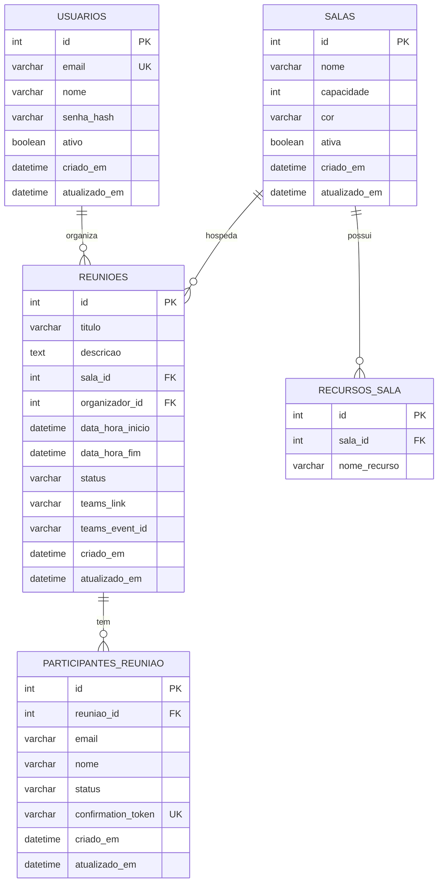
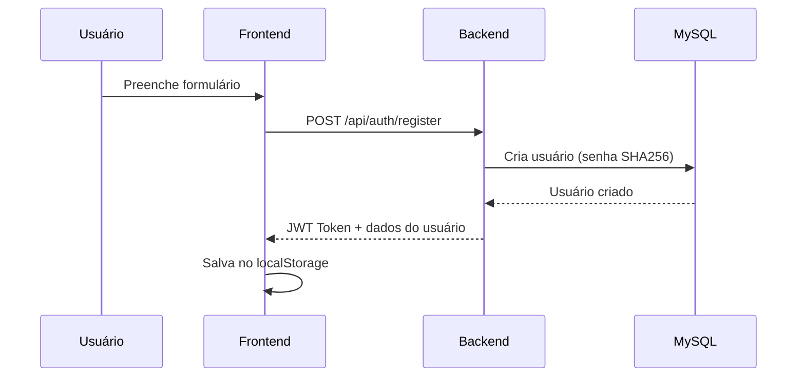
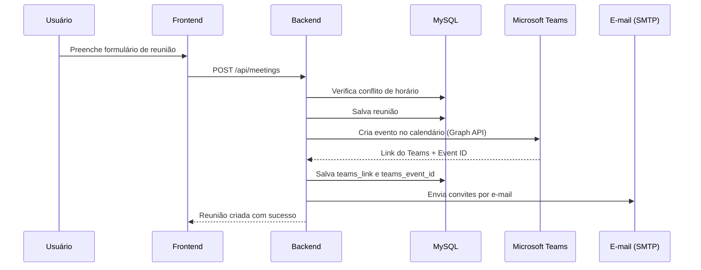
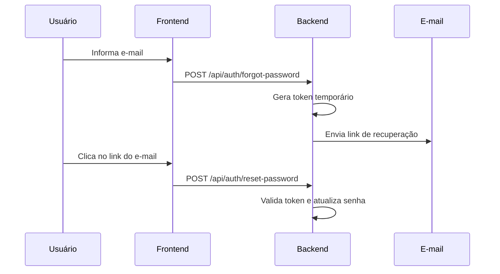

# 📅 Sistema de Agendamento de Reuniões

Sistema completo para agendamento de salas de reunião com integração com **Microsoft Teams**. Desenvolvido com **FastAPI** (Backend) e **React + Vite** (Frontend).

---

## 📋 Índice

- [Visão Geral](#visão-geral)
- [Tecnologias](#tecnologias)
- [Arquitetura do Projeto](#arquitetura-do-projeto)
- [Banco de Dados](#banco-de-dados)
- [Backend (API)](#backend-api)
- [Frontend](#frontend)
- [Integração com Microsoft Teams](#integração-com-microsoft-teams)
- [Configuração e Instalação](#configuração-e-instalação)
- [Variáveis de Ambiente](#variáveis-de-ambiente)
- [Execução](#execução)
- [Endpoints da API](#endpoints-da-api)

---

## Visão Geral

O sistema permite que funcionários agendem reuniões em salas de reunião corporativas. Principais funcionalidades:

- **Autenticação**: Registro, login, recuperação de senha por e-mail
- **Agendamento**: Criar, visualizar e cancelar reuniões
- **Salas**: 6 salas pré-configuradas com cores e recursos
- **Calendário**: Visualização mensal de todas as reuniões
- **E-mails**: Convites com botão de confirmação/recusa
- **Microsoft Teams**: Criação automática de reunião online com link do Teams
- **Conflito de horários**: Verificação automática de disponibilidade

---

## Tecnologias

### Backend
| Tecnologia | Versão | Finalidade |
|---|---|---|
| Python | 3.x | Linguagem principal |
| FastAPI | 0.104.1 | Framework web assíncrono |
| Uvicorn | 0.24.0 | Servidor ASGI |
| SQLAlchemy | 2.0.23 | ORM (Mapeamento Objeto-Relacional) |
| aiomysql | 0.2.0 | Driver MySQL assíncrono |
| python-jose | 3.3.0 | Geração/validação de JWT |
| httpx | 0.25.1 | Cliente HTTP assíncrono (Graph API) |
| Pydantic | 2.5.0 | Validação de dados |
| email-validator | 2.1.0 | Validação de e-mails |

### Frontend
| Tecnologia | Versão | Finalidade |
|---|---|---|
| React | 18.2.0 | Biblioteca de UI |
| Vite | 5.1.0 | Build tool e dev server |
| React Router DOM | 6.22.0 | Roteamento SPA |
| Axios | 1.6.7 | Cliente HTTP |
| date-fns | 3.3.1 | Manipulação de datas |
| Lucide React | 0.323.0 | Ícones |

### Infraestrutura
| Tecnologia | Finalidade |
|---|---|
| MySQL | Banco de dados relacional |
| Microsoft Graph API | Integração Teams/Outlook |
| SMTP (Office 365) | Envio de e-mails |

---

## Arquitetura do Projeto

```
sistema-agendamento/
├── backend/
│   ├── app/
│   │   ├── __init__.py
│   │   ├── main.py              # Ponto de entrada da API (FastAPI + CORS)
│   │   ├── config.py            # Configurações (env vars)
│   │   ├── database.py          # Modelos SQLAlchemy + init do banco
│   │   ├── models/              # Schemas Pydantic (validação)
│   │   │   ├── user.py          # UserCreate, UserResponse, TokenData
│   │   │   ├── meeting.py       # MeetingCreate, MeetingResponse, Attendee
│   │   │   └── room.py          # RoomBase, RoomResponse
│   │   ├── routes/              # Endpoints da API
│   │   │   ├── auth.py          # Login, registro, recuperação de senha
│   │   │   ├── meetings.py      # CRUD de reuniões, calendário, convites
│   │   │   └── rooms.py         # Listagem de salas
│   │   └── services/            # Lógica de negócio
│   │       ├── auth_service.py  # JWT (criar, verificar tokens)
│   │       ├── email_service.py # Envio de e-mails (convites, cancelamentos)
│   │       ├── graph_service.py # Microsoft Graph API (Teams)
│   │       └── meeting_service.py # Lógica de reuniões (não usado diretamente)
│   ├── .env                     # Variáveis de ambiente
│   ├── .env.example             # Exemplo de configuração
│   ├── requirements.txt         # Dependências Python
│   └── start.bat                # Script para iniciar o backend
│
└── frontend/
    ├── src/
    │   ├── main.jsx             # Ponto de entrada React
    │   ├── App.jsx              # Rotas da aplicação
    │   ├── index.css            # Estilos globais (CSS puro)
    │   ├── config/
    │   │   └── msalConfig.js    # Configuração MSAL + URL da API
    │   ├── contexts/
    │   │   └── AuthContext.jsx  # Contexto de autenticação (login/logout)
    │   ├── services/
    │   │   ├── api.js           # Instância Axios c/ interceptors
    │   │   ├── meetingService.js # Serviço de reuniões
    │   │   └── roomService.js   # Serviço de salas
    │   ├── components/
    │   │   ├── Layout/
    │   │   │   ├── Layout.jsx   # Layout principal (sidebar + header)
    │   │   │   ├── Header.jsx   # Cabeçalho com nome do usuário
    │   │   │   └── Sidebar.jsx  # Menu lateral de navegação
    │   │   ├── Calendar/
    │   │   │   └── Calendar.jsx # Componente de calendário mensal
    │   │   └── Common/
    │   │       └── Toast.jsx    # Sistema de notificações toast
    │   └── pages/
    │       ├── Login.jsx           # Tela de login
    │       ├── Register.jsx        # Tela de registro
    │       ├── ForgotPassword.jsx  # Esqueci minha senha
    │       ├── ResetPassword.jsx   # Redefinir senha
    │       ├── Dashboard.jsx       # Painel principal
    │       ├── CalendarPage.jsx    # Página do calendário
    │       ├── NewMeeting.jsx      # Criar nova reunião
    │       ├── MyMeetings.jsx      # Minhas reuniões
    │       ├── Rooms.jsx           # Salas de reunião
    │       ├── MeetingResponse.jsx # Aceitar/recusar convite
    │       ├── AuthCallback.jsx    # Callback OAuth (MSAL)
    │       └── DevLogin.jsx        # Login dev (auxiliar)
    ├── .env                     # Variáveis de ambiente frontend
    ├── package.json             # Dependências Node.js
    └── vite.config.js           # Configuração do Vite
```

---

## Banco de Dados

O sistema utiliza **MySQL** com 5 tabelas, definidas em `backend/app/database.py` usando SQLAlchemy ORM.

### Diagrama Entidade-Relacionamento



### Tabelas

| Tabela | Descrição |
|---|---|
| `usuarios` | Usuários do sistema (email, nome, senha hash) |
| `salas` | Salas de reunião (nome, capacidade, cor, recursos) |
| `recursos_sala` | Recursos de cada sala (TV, Webcam, etc.) |
| `reunioes` | Reuniões agendadas (título, sala, horários, link Teams) |
| `participantes_reuniao` | Participantes de cada reunião (email, status de confirmação) |

### Salas Padrão (criadas automaticamente)

| Sala | Capacidade | Cor | Recursos |
|---|---|---|---|
| Sala 02 | 4 pessoas | 🔵 Azul | TV |
| Sala 03 | 6 pessoas | 🟣 Roxo | TV |
| Sala 04 | 12 pessoas | 🟢 Verde | TV |
| Sala Conselho | 5 pessoas | 🟡 Amarelo | TV, Webcam |
| Showroom | 20 pessoas | 🔴 Vermelho | TV |
| ShowroomSP | 8 pessoas | 🔵 Ciano | TV |

---

## Backend (API)

### Estrutura de Serviços

| Serviço | Arquivo | Responsabilidade |
|---|---|---|
| **AuthService** | `auth_service.py` | Criação/validação de JWT tokens |
| **EmailService** | `email_service.py` | Envio de convites e cancelamentos por e-mail |
| **GraphService** | `graph_service.py` | Integração Microsoft Graph API (Teams) |
| **MeetingService** | `meeting_service.py` | Lógica de negócio de reuniões (não usado diretamente) |

### Fluxos Principais

#### 1. Registro e Login


#### 2. Criar Reunião


#### 3. Recuperação de Senha


---

## Frontend

### Páginas

| Rota | Componente | Descrição | Acesso |
|---|---|---|---|
| `/login` | `Login.jsx` | Tela de login com e-mail e senha | Público |
| `/register` | `Register.jsx` | Registro de novo usuário | Público |
| `/forgot-password` | `ForgotPassword.jsx` | Solicitar reset de senha | Público |
| `/reset-password` | `ResetPassword.jsx` | Redefinir senha via token | Público |
| `/meeting-response` | `MeetingResponse.jsx` | Aceitar/recusar convite | Público |
| `/` | `Dashboard.jsx` | Painel principal com resumo | Privado |
| `/calendar` | `CalendarPage.jsx` | Calendário mensal interativo | Privado |
| `/new-meeting` | `NewMeeting.jsx` | Formulário de nova reunião | Privado |
| `/my-meetings` | `MyMeetings.jsx` | Lista de reuniões do usuário | Privado |
| `/rooms` | `Rooms.jsx` | Visualização das salas | Privado |

### Componentes Reutilizáveis

| Componente | Descrição |
|---|---|
| `Layout.jsx` | Container principal com Sidebar e Header |
| `Sidebar.jsx` | Menu lateral de navegação |
| `Header.jsx` | Cabeçalho com nome do usuário e botão de logout |
| `Calendar.jsx` | Grade de calendário mensal com eventos coloridos |
| `Toast.jsx` | Sistema global de notificações (sucesso/erro/alerta) |

### Contexto de Autenticação

O `AuthContext.jsx` gerencia o estado de autenticação:
- Armazena `user` e `token` no `localStorage`
- Disponibiliza funções `login()`, `register()`, `logout()`
- Protege rotas privadas com `PrivateRoute`

### Serviços API

| Serviço | Funções |
|---|---|
| `api.js` | Instância Axios com interceptors (token JWT automático, redirect em 401) |
| `meetingService.js` | `getMeetings()`, `createMeeting()`, `cancelMeeting()`, `checkAvailability()`, etc. |
| `roomService.js` | `getRooms()`, `getRoom()`, `checkRoomAvailability()` |

---

## Integração com Microsoft Teams

O sistema cria **Eventos de Calendário** no Outlook/Teams usando a Microsoft Graph API.

### Como Funciona

1. Ao criar uma reunião, o backend chama `GraphService.create_calendar_event()`
2. A API cria um evento no calendário do organizador com `isOnlineMeeting: true`
3. O Microsoft 365 gera automaticamente um link do Teams
4. Participantes recebem convites do Outlook com opção de aceitar/recusar
5. Ao cancelar, o sistema chama `GraphService.cancel_calendar_event()`

### Autenticação Azure

Utiliza o fluxo **Client Credentials** (aplicação → aplicação):
- Não requer interação do usuário
- Token OAuth2 obtido automaticamente
- Cache de token com renovação 5 minutos antes da expiração

### Funcionalidades Integradas

| Recurso | Descrição |
|---|---|
| 🎥 Link do Teams | Gerado automaticamente ao criar reunião |
| 📧 Convite por e-mail | Inclui botão "Entrar pelo Teams" |
| 📅 Calendário Outlook | Reunião aparece no calendário do organizador |
| 🔔 Notificações | Lembretes automáticos 15 min antes |
| ❌ Cancelamento | Remove evento do Teams ao cancelar reunião |

---

## Configuração e Instalação

### Pré-requisitos

- Python 3.9+
- Node.js 18+
- MySQL 8.0+

### 1. Banco de Dados

```sql
CREATE DATABASE sistema_agendamento CHARACTER SET utf8mb4 COLLATE utf8mb4_unicode_ci;
```

> As tabelas são criadas automaticamente pelo SQLAlchemy na primeira execução.

### 2. Backend

```bash
cd backend

# Criar ambiente virtual
python -m venv venv

# Ativar ambiente virtual
.\venv\Scripts\activate        # Windows
# source venv/bin/activate     # Linux/Mac

# Instalar dependências
pip install -r requirements.txt

# Configurar .env (copiar e editar)
copy .env.example .env
```

### 3. Frontend

```bash
cd frontend

# Instalar dependências
npm install

# Configurar .env (copiar e editar)
copy .env.example .env
```

---

## Variáveis de Ambiente

### Backend (`backend/.env`)

```env
# MySQL
MYSQL_HOST=localhost
MYSQL_PORT=3306
MYSQL_USER=root
MYSQL_PASSWORD=
MYSQL_DATABASE=sistema_agendamento

# JWT
JWT_SECRET_KEY=sua-chave-secreta-aqui
JWT_ALGORITHM=HS256
ACCESS_TOKEN_EXPIRE_MINUTES=60

# Frontend URL
FRONTEND_URL=http://localhost:5173

# SMTP (Office 365)
SMTP_HOST=smtp.office365.com
SMTP_PORT=587
SMTP_USER=seu-email@empresa.com.br
SMTP_PASSWORD=sua-senha
EMAIL_FROM=seu-email@empresa.com.br
EMAIL_FROM_NAME=Sistema de Agendamento

# Microsoft Azure / Teams
AZURE_CLIENT_ID=seu-client-id
AZURE_TENANT_ID=seu-tenant-id
AZURE_CLIENT_SECRET=seu-client-secret
AZURE_ORGANIZER_EMAIL=organizador@empresa.com.br
```

### Frontend (`frontend/.env`)

```env
# URL da API
VITE_API_URL=http://localhost:8000

# Microsoft Azure AD (opcional)
VITE_MICROSOFT_CLIENT_ID=
VITE_MICROSOFT_TENANT_ID=
VITE_MICROSOFT_REDIRECT_URI=http://localhost:5173/auth/callback
```

---

## Execução

### Modo Rápido (Windows)

```bash
# Backend
cd backend
start.bat

# Frontend (em outro terminal)
cd frontend
npm run dev
```

### Modo Manual

```bash
# Terminal 1: Backend
cd backend
.\venv\Scripts\activate
uvicorn app.main:app --reload --port 8000

# Terminal 2: Frontend
cd frontend
npm run dev
```

### Acessar

- **Frontend**: http://localhost:5173
- **Backend API**: http://localhost:8000
- **Documentação API**: http://localhost:8000/docs (Swagger)

---

## Endpoints da API

### Autenticação (`/api/auth`)

| Método | Endpoint | Descrição | Auth |
|---|---|---|---|
| `POST` | `/api/auth/register` | Registrar novo usuário | ❌ |
| `POST` | `/api/auth/login` | Login (retorna JWT) | ❌ |
| `GET` | `/api/auth/me` | Dados do usuário logado | ✅ |
| `POST` | `/api/auth/forgot-password` | Solicitar reset de senha | ❌ |
| `POST` | `/api/auth/reset-password` | Redefinir senha com token | ❌ |

### Reuniões (`/api/meetings`)

| Método | Endpoint | Descrição | Auth |
|---|---|---|---|
| `GET` | `/api/meetings` | Listar reuniões do usuário | ✅ |
| `POST` | `/api/meetings` | Criar nova reunião | ✅ |
| `GET` | `/api/meetings/{id}` | Detalhes de uma reunião | ✅ |
| `DELETE` | `/api/meetings/{id}` | Cancelar reunião | ✅ |
| `GET` | `/api/meetings/calendar` | Eventos do calendário (por período) | ✅ |
| `GET` | `/api/meetings/check-availability` | Verificar disponibilidade de sala | ✅ |

### Confirmação de Presença (Público)

| Método | Endpoint | Descrição | Auth |
|---|---|---|---|
| `GET` | `/meetings/confirm/{token}` | Confirmar/recusar via link do e-mail | ❌ |
| `GET` | `/api/meetings/response/{token}/info` | Info do convite pelo token | ❌ |
| `POST` | `/api/meetings/response/{token}` | Responder convite (aceitar/recusar) | ❌ |

### Salas (`/api/rooms`)

| Método | Endpoint | Descrição | Auth |
|---|---|---|---|
| `GET` | `/api/rooms` | Listar salas ativas | ✅ |
| `GET` | `/api/rooms/{id}` | Detalhes de uma sala | ✅ |

---

## Segurança

- **Senhas**: Hash SHA-256 (produção: migrar para bcrypt)
- **Autenticação**: JWT com expiração de 60 minutos
- **CORS**: Configurado para aceitar origens específicas
- **Azure**: Client credentials flow (sem interação do usuário)
- **E-mail**: SMTP com TLS (porta 587)

---

## Status dos Participantes

| Status | Significado |
|---|---|
| `pendente` | Convite enviado, aguardando resposta |
| `confirmado` | Participante confirmou presença |
| `recusado` | Participante recusou o convite |

## Status das Reuniões

| Status | Significado |
|---|---|
| `agendada` | Reunião ativa e confirmada |
| `cancelada` | Reunião cancelada pelo organizador |
| `concluida` | Reunião já realizada |

---

> **Desenvolvido para uso interno** — Sistema de Agendamento de Salas de Reunião com integração Microsoft Teams.
